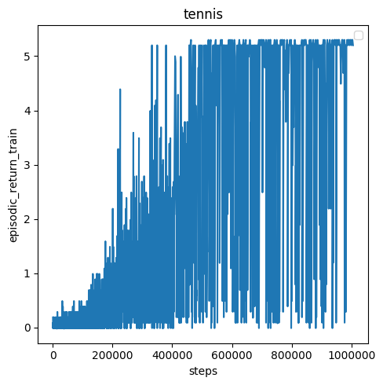
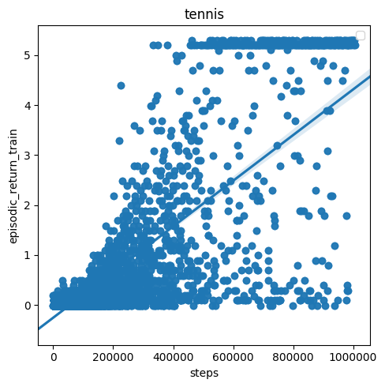
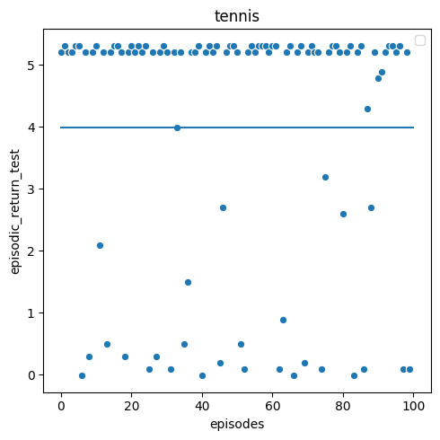

### Implementation details:
The algorithm used is Proximal Policy Optimization (PPO) with clipping of the loss function and Generalized Advantage Estimation (GAE).

For both actor and critic (advantage estimator), a two layer 256 by 256 feed-forward neural network is used.
For the activations, tanh function is used.

The PPO parameters are as follows:
* Optimizer: ADAM, learning rate: 0.0003, epsilon: 0.00005
* Discount rate: 0.99
* Tau parameter of GAE function: 0.95
* Gradient clipping: 0.5
* PPO clipping / PPO epsilon: 0.2
* Rollout length (number of episodes collected for each optimization step): 8192
* Number of optimization steps for each rollout: 40
* Mini batch size: 4096
* Train for one million steps

### Training
Using the above parameters, two agents using **the same action and critic network** are trained.
After 1 million epochs, they are able to perform well in most of the episodes.
However it's not able to consistently score a high reward. Every now and than they looses an episode rather quickly.

The first plot shows the episodic return of training on 1 million steps, connecting each data point with a line.
For better interpretability, the second plot fits a linear regression on the same data.

### Evaluation
After training for 1 million iterations, the agent is evaluated on 100 episodes.
The mean reward is 3.99 with a standard deviation of 2.07.

### Playing against the agent
Another way to evaluate performance of the agent is to simply play against it, or to watch it playing against itself.
Watching the agent playing itself, it can be observed the agent found a kind of local minima: It learned to always
pass the ball in the same manner, thus making it easy for the other agent (itself!) to catch it.

I confirm this by playing against the agent myself, and finding out it performs bad on fast or low approaching balls.
To train an even better agent, the reward would need to be altered to train for competetive behavior, as this 
requires the agent to learn how to handle more hard to catch balls as well.

### Further steps
- Train competetive behavior (as described above)
- As PPO comes with a host of different parameters to look at, performance could certainly
be improved by further fine tuning of parameters.
- Additionally, there are 3 more algorithms for continuous control implemented within this framework: 
TD3, DDPG and A2C. One could also try out those.
