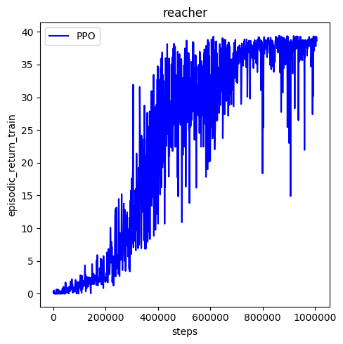
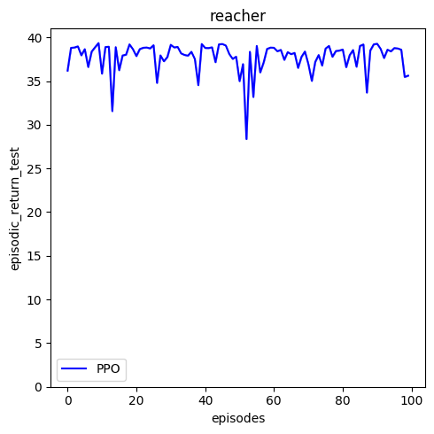

### Implementation details:
The algorithm used is Proximal Policy Optimization (PPO) with clipping of the loss function and Generalized Advantage Estimation (GAE).

For both actor and critic (advantage estimator), a two layer 256 by 256 feed-forward neural network is used.
For the activations, tanh function is used.

The PPO parameters are as follows:
* Optimizer: ADAM, learning rate: 0.0003, epsilon: 0.00005
* Discount rate: 0.99
* Tau parameter of GAE function: 0.95
* Gradient clipping: 0.5
* PPO clipping / PPO epsilon: 0.2
* Rollout length (number of episodes collected for each optimization step): 8192
* Number of optimization steps for each rollout: 40
* Mini batch size: 4096
* Train for one million steps

### Training
Using the above parameters, the agent stably converges close to the optimal reward:

### Evaluation
After training for 1 million iterations, the agent was evaluated on 100 episodes.
The mean reward is 37.66 with a standard deviation of 0.22.

### Further steps:
- As PPO comes with a host of different parameters to look at, performance could certainly
be improved by further fine tuning of parameters.
- Additionally, there are 3 more algorithms for continuous control implemented within this framework: 
TD3, DDPG and A2C. One could also try to solve Reacher using those algorithms
